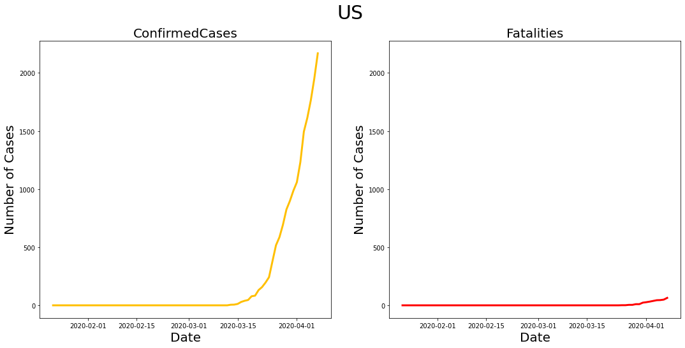
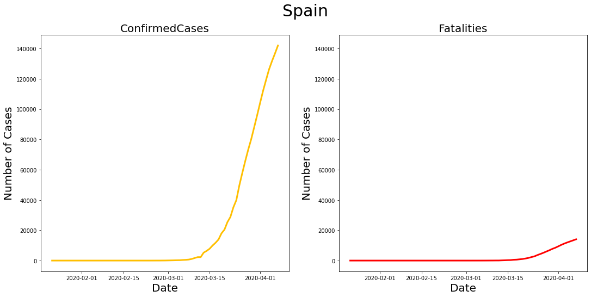

```python
# This Python 3 environment comes with many helpful analytics libraries installed
# It is defined by the kaggle/python docker image: https://github.com/kaggle/docker-python
# For example, here's several helpful packages to load in 

import numpy as np # linear algebra
import pandas as pd # data processing, CSV file I/O (e.g. pd.read_csv)

# Input data files are available in the "../input/" directory.
# For example, running this (by clicking run or pressing Shift+Enter) will list all files under the input directory

import os
for dirname, _, filenames in os.walk('/kaggle/input'):
    for filename in filenames:
        os.path.join(dirname, filename)

# Any results you write to the current directory are saved as output.
```

# Link to Competition
https://www.kaggle.com/c/covid19-global-forecasting-week-3/data

# Background
> The White House Office of Science and Technology Policy (OSTP) pulled together a coalition research groups and companies (including Kaggle) to prepare the COVID-19 Open Research Dataset (CORD-19) to attempt to address key open scientific questions on COVID-19. Those questions are drawn from National Academies of Sciences, Engineering, and Medicine’s (NASEM) and the World Health Organization (WHO).

# The Challenge
> Kaggle is launching a companion COVID-19 forecasting challenges to help answer a subset of the NASEM/WHO questions. While the challenge involves forecasting confirmed cases and fatalities between April 1 and April 30 by region, the primary goal isn't only to produce accurate forecasts. It’s also to identify factors that appear to impact the transmission rate of COVID-19.

> You are encouraged to pull in, curate and share data sources that might be helpful. If you find variables that look like they impact the transmission rate, please share your finding in a notebook.

> As the data becomes available, we will update the leaderboard with live results based on data made available from the Johns Hopkins University Center for Systems Science and Engineering (JHU CSSE).

> We have received support and guidance from health and policy organizations in launching these challenges. We're hopeful the Kaggle community can make valuable contributions to developing a better understanding of factors that impact the transmission of COVID-19.

# Companies and Organizations
> There is also a call to action for companies and other organizations: If you have datasets that might be useful, please upload them to Kaggle’s dataset platform and reference them in this forum thread. That will make them accessible to those participating in this challenge and a resource to the wider scientific community.

# Acknowledgements
> JHU CSSE for making the data available to the public. The White House OSTP for pulling together the key open questions. The image comes from the Center for Disease Control.

# Data Description
> In this challenge, you will be predicting the cumulative number of confirmed COVID19 cases in various locations across the world, as well as the number of resulting fatalities, for future dates.
> 
> We understand this is a serious situation, and in no way want to trivialize the human impact this crisis is causing by predicting fatalities. Our goal is to provide better methods for estimates that can assist medical and governmental institutions to prepare and adjust as pandemics unfold.

# Files
> train.csv - the training data (you are encouraged to join in many more useful external datasets)
> test.csv - the dates to predict; there is a week of overlap with the training data for the initial Public leaderboard. Once submissions are paused, the Public leaderboard will update based on last 28 days of predicted data.
> submission.csv - a sample submission in the correct format; again, predictions should be cumulative

# Data Source
> This evaluation data for this competition comes from John Hopkins CSSE, which is uninvolved in the competition.
> See their README for a description of how the data was collected.
> They are currently updating the data daily.

# Importing Modules


```python
import numpy as np
import pandas as pd
import seaborn as sns
import matplotlib.pyplot as plt
import itertools
import statsmodels.api as sm
from scipy import stats
import warnings
warnings.filterwarnings('ignore')
from matplotlib import rcParams
rcParams['figure.figsize'] = 18,8
```

# Loading and Preparing Data


```python
train = pd.read_csv("/kaggle/input/covid19-global-forecasting-week-3/train.csv")
test = pd.read_csv("/kaggle/input/covid19-global-forecasting-week-3/test.csv")
submission = pd.read_csv("/kaggle/input/covid19-global-forecasting-week-3/submission.csv")
max_val = len(train[train['Country_Region'] == 'Afghanistan'])
country_dict= dict()
for itr in range(len(train)):
    if train.loc[itr]['Country_Region'] not in country_dict.keys():
        country_dict[train.loc[itr]['Country_Region']]= []
    else:
        if len(country_dict[train.loc[itr]['Country_Region']])>=max_val:
            continue
    country_dict[train.loc[itr]['Country_Region']].append([[train.loc[itr]['Date']],[train.loc[itr]['ConfirmedCases']],[train.loc[itr]['Fatalities']]])    
    
time_series_dict = dict()
for country in country_dict.keys():
    for case in ['ConfirmedCases','Fatalities']:
        tsz=train.loc[(train['Country_Region']==country)]
        tsz=tsz[['Date',case]]
        x = []
        for itr in tsz.index:
            x.append([pd.to_datetime(tsz.loc[itr]['Date']),tsz.loc[itr][case]])
        tsz = pd.DataFrame(x,columns = ['Date',case])
        tsz=tsz.set_index('Date')
        tsz
        if country not in time_series_dict.keys():
            time_series_dict[country] = dict()
        time_series_dict[country][case] = tsz
```

# Visualizations


```python
rank_country = dict()
for country in country_dict.keys():
    rank_country[country]=[max(time_series_dict[country]['ConfirmedCases']['ConfirmedCases']),max(time_series_dict[country]['Fatalities']['Fatalities'])]
rank_country = sorted(rank_country.items(), key = lambda kv:(kv[1][0],kv[1][1], kv[0]),reverse = True)[:20]

labels = [y[0] for y in rank_country]
ConfirmedCases = [y[1][0] for y in rank_country]
Fatalities = [y[1][1] for y in rank_country]

x = np.arange(len(labels))  # the label locations
width = 0.35  # the width of the bars

fig, ax = plt.subplots()
rects1 = ax.bar(x - width/2, ConfirmedCases, width, label='ConfirmedCases',color = '#FFBF00')
rects2 = ax.bar(x + width/2, Fatalities, width, label='Fatalities',color = 'red')

# Add some text for labels, title and custom x-axis tick labels, etc.
ax.set_ylabel('Number of Cases',fontsize=30, fontweight=20)
ax.set_title('COVID-19',fontsize=30, fontweight=20)
ax.set_xticks(x)
ax.set_xticklabels(labels)
ax.legend()


def autolabel(rects):
    for rect in rects:
        height = rect.get_height()
        ax.annotate('{}'.format(height),
                    xy=(rect.get_x() + rect.get_width() / 2, height),
                    xytext=(0, 3),  # 3 points vertical offset
                    textcoords="offset points",
                    ha='center', va='bottom')

autolabel(rects1)
autolabel(rects2)
fig.tight_layout()
plt.show()
```


```python
color_pallete = ['#FFBF00','red']
for country in ['India','China','US','Italy','Spain']:
    case_number = 1
    for case in ['ConfirmedCases','Fatalities']:
        plt.subplot(1,2,case_number)
        plt.title(case, loc='center', fontsize=20, fontweight=10)
        if case_number==2:
            plt.ylim(bottom,top)
        plt.plot(time_series_dict[country][case][:max_val], color=color_pallete[case_number-1], linewidth=3, alpha=1)
        plt.xlabel('Date', fontsize=20)
        plt.ylabel('Number of Cases', fontsize=20)
        if case_number==1:
            bottom,top = plt.ylim()
        case_number = case_number + 1
    plt.suptitle(country, fontsize=30, fontweight=20)
    plt.show()

```








# SARIMAX Model 

> Seasonal Autoregressive Integrated Moving Average, SARIMA or Seasonal ARIMA, is an extension of ARIMA that explicitly supports univariate time-series data with a seasonal component. It adds three new hyperparameters to specify the autoregression (AR), differencing (I) and moving average (MA) for the seasonal component of the series, as well as an additional parameter for the period of the seasonality.


```python
prediction_country_list = dict()
count = 0
for country in country_dict.keys():
    prediction_country_list[country] = dict()
    for case in ['ConfirmedCases','Fatalities']:
        start = 0
        end = max_val
        prediction_country_list[country][case] = []
        len(time_series_dict[country][case])//max_val
        for i in range(len(time_series_dict[country][case])//max_val):
            mod = sm.tsa.statespace.SARIMAX(time_series_dict[country][case].iloc[start:end],
                                                order=(1,1,1),
                                                trend = np.flip(np.polyfit(range(0,7),time_series_dict[country][case].iloc[end-7:end],4),1),
                                                enforce_stationarity=True,
                                                enforce_invertibility=True)
            results = mod.fit()
            pred = results.get_prediction(start=pd.to_datetime('2020-03-26'),end=pd.to_datetime('2020-05-07'),dynamic=True )
            prediction_country_list[country][case].append(pred.predicted_mean)
            start = start + max_val
            end = end + max_val
    count = count+1
```

# Preparing Submission File


```python
forecastid = 1
submission_out = []
for country in country_dict.keys():
    for itr in range(len(prediction_country_list[country]['ConfirmedCases'])):
        for index in prediction_country_list[country]['ConfirmedCases'][itr].index:
            submission_out.append([forecastid,prediction_country_list[country]['ConfirmedCases'][itr][index],prediction_country_list[country]['Fatalities'][itr][index]])
            forecastid = forecastid +1
for i in range(len(submission_out)):
    submission_out[i][1] = round(submission_out[i][1])
    submission_out[i][2] = round(submission_out[i][2])
# submission_file = pd.DataFrame(submission_out,columns=['ForecastId','ConfirmedCases','Fatalities'])
# submission_file.to_csv('submission.csv',index = False)
```

# XGBOOST Regressor

> **XGBoost stands for eXtreme Gradient Boosting.**
> 
> The name xgboost, though, actually refers to the engineering goal to push the limit of computations resources for boosted tree algorithms. Which is the reason why many people use xgboost.
> This algorithm goes by lots of different names such as gradient boosting, multiple additive regression trees, stochastic gradient boosting or gradient boosting machines.
> 
> Boosting is an ensemble technique where new models are added to correct the errors made by existing models. Models are added sequentially until no further improvements can be made. A popular example is the AdaBoost algorithm that weights data points that are hard to predict.
> 
> Gradient boosting is an approach where new models are created that predict the residuals or errors of prior models and then added together to make the final prediction. It is called gradient boosting because it uses a gradient descent algorithm to minimize the loss when adding new models.
> 
> This approach supports both regression and classification predictive modeling problems.


```python
import xgboost as xgb
from xgboost import plot_importance, plot_tree
from sklearn.metrics import mean_squared_error, mean_absolute_error
```


```python
train = pd.read_csv("/kaggle/input/covid19-global-forecasting-week-3/train.csv")
test = pd.read_csv("/kaggle/input/covid19-global-forecasting-week-3/test.csv")
submission = pd.read_csv("/kaggle/input/covid19-global-forecasting-week-3/submission.csv")
train.Date = pd.to_datetime(train.Date)
test.Date = pd.to_datetime(test.Date)
train['Date'] = train['Date'].dt.strftime("%d%m").astype(int)
test['Date'] = test['Date'].dt.strftime("%d%m").astype(int)
```


```python
country_dict= dict()
province_list = []
for itr in range(len(train)):
    if train.loc[itr]['Country_Region'] not in country_dict.keys():
        country_dict[train.loc[itr]['Country_Region']]= dict()
    if str(train.iloc[itr]['Province_State']) != 'nan':
        province_list.append(train.iloc[itr]['Province_State'])
        if train.loc[itr]['Province_State'] not in country_dict[train.loc[itr]['Country_Region']].keys():
            country_dict[train.loc[itr]['Country_Region']][train.loc[itr]['Province_State']] = dict()
            country_dict[train.loc[itr]['Country_Region']][train.loc[itr]['Province_State']]['ConfirmedCases'] = []
            country_dict[train.loc[itr]['Country_Region']][train.loc[itr]['Province_State']]['Fatalities'] = []
        country_dict[train.loc[itr]['Country_Region']][train.loc[itr]['Province_State']]['ConfirmedCases'].append([train.loc[itr]['Date'],train.loc[itr]['ConfirmedCases']])
        country_dict[train.loc[itr]['Country_Region']][train.loc[itr]['Province_State']]['Fatalities'].append([train.loc[itr]['Date'],train.loc[itr]['Fatalities']])
    if str(train.loc[itr]['Province_State']) == 'nan':
        province_list.append(train.iloc[itr]['Country_Region'])
        if train.loc[itr]['Country_Region'] not in country_dict[train.loc[itr]['Country_Region']].keys():
            country_dict[train.loc[itr]['Country_Region']][train.loc[itr]['Country_Region']] = dict()
            country_dict[train.loc[itr]['Country_Region']][train.loc[itr]['Country_Region']]['ConfirmedCases'] = []
            country_dict[train.loc[itr]['Country_Region']][train.loc[itr]['Country_Region']]['Fatalities'] = []
        country_dict[train.loc[itr]['Country_Region']][train.loc[itr]['Country_Region']]['ConfirmedCases'].append([train.loc[itr]['Date'],train.loc[itr]['ConfirmedCases']])
        country_dict[train.loc[itr]['Country_Region']][train.loc[itr]['Country_Region']]['Fatalities'].append([train.loc[itr]['Date'],train.loc[itr]['Fatalities']])
```


```python
test_dates = []
for itr in range(len(test)):
    if test.iloc[itr]['Country_Region'] == 'Afghanistan':
        test_dates.append(test.iloc[itr]['Date'])
test_dates = np.array(test_dates)
```


```python
pred_dict = dict()
for country in country_dict.keys():
    pred_dict[country] = dict()
    for province in country_dict[country].keys():
        train_x_ConfirmedCases = train_x_Fatalities = pd.DataFrame(country_dict[country][province]['ConfirmedCases'])[0].values.reshape(-1,1)
        train_y_ConfirmedCases = pd.DataFrame(country_dict[country][province]['ConfirmedCases'])[1].values
        train_y_Fatalities = pd.DataFrame(country_dict[country][province]['Fatalities'])[1].values
        test_x_ConfirmedCases = test_x_Fatalities = test_dates.reshape(-1,1)
        pred_y_ConfirmedCases = xgb.XGBRegressor(n_estimators=500).fit(train_x_ConfirmedCases, train_y_ConfirmedCases).predict(test_x_ConfirmedCases)
        pred_y_Fatalities = xgb.XGBRegressor(n_estimators=500).fit(train_x_Fatalities, train_y_Fatalities).predict(test_x_Fatalities)
        pred_dict[country][province] = dict()
        pred_dict[country][province]['ConfirmedCases'] = pred_y_ConfirmedCases
        pred_dict[country][province]['Fatalities'] = pred_y_Fatalities
```


```python
ForecastId = 1
submission_out = []
for country in country_dict.keys():
    for province in country_dict[country].keys():
        for i in range(len(pred_dict[country][province]['ConfirmedCases'])):
            submission_out.append([ForecastId,pred_dict[country][province]['ConfirmedCases'][i],pred_dict[country][province]['Fatalities'][i]])
            ForecastId = ForecastId + 1
# submission_file = pd.DataFrame(submission_out,columns=['ForecastId','ConfirmedCases','Fatalities'])
# submission_file.to_csv('submission.csv',index = False)
```

# Improvement in XGBoost

> Adding Date as feature to XGBOOST as integer


```python
import xgboost as xgb
```


```python
train = pd.read_csv("/kaggle/input/covid19-global-forecasting-week-3/train.csv")
test = pd.read_csv("/kaggle/input/covid19-global-forecasting-week-3/test.csv")
submission = pd.read_csv("/kaggle/input/covid19-global-forecasting-week-3/submission.csv")
train.Date = pd.to_datetime(train.Date)
test.Date = pd.to_datetime(test.Date)
train['Month'] = train['Date'].dt.strftime("%m").astype(int)
train['Date'] = train['Date'].dt.strftime("%d").astype(int)
test['Month'] = test['Date'].dt.strftime("%m").astype(int)
test['Date'] = test['Date'].dt.strftime("%d").astype(int)
```


```python
# use pd.concat to join the new columns with your original dataframe
df = pd.concat([train,pd.get_dummies(train['Country_Region'], prefix='Country_Region')],axis=1)
df2 = pd.concat([df,pd.get_dummies(df['Province_State'], prefix='Province_State')],axis=1)
df2.drop(['Country_Region','Province_State'],axis=1, inplace=True)
train_y_ConfirmedCases,train_y_Fatalities = df2['ConfirmedCases'],df2['Fatalities']
df2.drop(['Id','ConfirmedCases','Fatalities'],axis=1, inplace=True)
train_x = df2
df3 = pd.concat([test,pd.get_dummies(test['Country_Region'], prefix='Country_Region')],axis=1)
df4 = pd.concat([df3,pd.get_dummies(df3['Province_State'], prefix='Province_State')],axis=1)
df4.drop(['ForecastId','Country_Region','Province_State'],axis=1, inplace=True)
test_x = df4
pred_y_ConfirmedCases = xgb.XGBRegressor(n_estimators=1500).fit(train_x, train_y_ConfirmedCases).predict(test_x)
pred_y_Fatalities = xgb.XGBRegressor(n_estimators=1500).fit(train_x, train_y_Fatalities).predict(test_x)
for i in range(len(pred_y_Fatalities)):
    pred_y_Fatalities[i] = round(pred_y_Fatalities[i])
    pred_y_ConfirmedCases[i] = round(pred_y_ConfirmedCases[i])
# submission_file = pd.DataFrame(list(zip(submission.ForecastId,pred_y_ConfirmedCases,pred_y_Fatalities)),columns=['ForecastId','ConfirmedCases','Fatalities'])
# submission_file.to_csv('submission.csv',index = False)
```

# Prophet by FACEBOOK


> Prophet is a procedure for forecasting time series data based on an additive model where non-linear trends are fit with yearly, weekly, and daily seasonality, plus holiday effects. It works best with time series that have strong seasonal effects and several seasons of historical data. Prophet is robust to missing data and shifts in the trend, and typically handles outliers well.


```python
train = pd.read_csv("/kaggle/input/covid19-global-forecasting-week-3/train.csv")
test = pd.read_csv("/kaggle/input/covid19-global-forecasting-week-3/test.csv")
submission = pd.read_csv("/kaggle/input/covid19-global-forecasting-week-3/submission.csv")
```


```python
country_dict= dict()
province_list = []
for itr in range(len(train)):
    if train.loc[itr]['Country_Region'] not in country_dict.keys():
        country_dict[train.loc[itr]['Country_Region']]= dict()
    if str(train.iloc[itr]['Province_State']) != 'nan':
        province_list.append(train.iloc[itr]['Province_State'])
        if train.loc[itr]['Province_State'] not in country_dict[train.loc[itr]['Country_Region']].keys():
            country_dict[train.loc[itr]['Country_Region']][train.loc[itr]['Province_State']] = dict()
            country_dict[train.loc[itr]['Country_Region']][train.loc[itr]['Province_State']]['ConfirmedCases'] = []
            country_dict[train.loc[itr]['Country_Region']][train.loc[itr]['Province_State']]['Fatalities'] = []
        country_dict[train.loc[itr]['Country_Region']][train.loc[itr]['Province_State']]['ConfirmedCases'].append([train.loc[itr]['Date'],train.loc[itr]['ConfirmedCases']])
        country_dict[train.loc[itr]['Country_Region']][train.loc[itr]['Province_State']]['Fatalities'].append([train.loc[itr]['Date'],train.loc[itr]['Fatalities']])
    if str(train.loc[itr]['Province_State']) == 'nan':
        province_list.append(train.iloc[itr]['Country_Region'])
        if train.loc[itr]['Country_Region'] not in country_dict[train.loc[itr]['Country_Region']].keys():
            country_dict[train.loc[itr]['Country_Region']][train.loc[itr]['Country_Region']] = dict()
            country_dict[train.loc[itr]['Country_Region']][train.loc[itr]['Country_Region']]['ConfirmedCases'] = []
            country_dict[train.loc[itr]['Country_Region']][train.loc[itr]['Country_Region']]['Fatalities'] = []
        country_dict[train.loc[itr]['Country_Region']][train.loc[itr]['Country_Region']]['ConfirmedCases'].append([train.loc[itr]['Date'],train.loc[itr]['ConfirmedCases']])
        country_dict[train.loc[itr]['Country_Region']][train.loc[itr]['Country_Region']]['Fatalities'].append([train.loc[itr]['Date'],train.loc[itr]['Fatalities']])
for country in country_dict.keys():
    for province in country_dict[country].keys():
        for case in country_dict[country][province].keys():
            for itr in range(len(country_dict[country][province][case])):
                country_dict[country][province][case][itr][0] = pd.to_datetime(country_dict[country][province][case][itr][0])
for country in country_dict.keys():
    for province in country_dict[country].keys():
        for case in country_dict[country][province].keys():
            country_dict[country][province][case] = pd.DataFrame(country_dict[country][province][case],columns=['ds','y'])
test_dates = pd.DataFrame(set(test['Date']),columns=['ds'])
```


```python
import pandas as pd
from fbprophet import Prophet
```


```python
for country in country_dict.keys():
    for province in country_dict[country].keys():
        for case in country_dict[country][province].keys():
            m = Prophet()
            m.fit(country_dict[country][province][case])
            forecast = m.predict(test_dates)
            country_dict[country][province][case] = forecast[['ds','yhat']]
submission_list = []
forecastId = 1
for country in country_dict.keys():
    for province in country_dict[country].keys():
        for itr in range(len(country_dict[country][province][case])):
            submission_list.append([forecastId,round(country_dict[country][province]['ConfirmedCases'].iloc[itr]['yhat']),round(country_dict[country][province]['Fatalities'].iloc[itr]['yhat'])])
            forecastId = forecastId+1
# submission_file = pd.DataFrame(submission_list,columns =['ForecastId','ConfirmedCases','Fatalities'])
# submission_file.to_csv('submission.csv',index = False)
```
